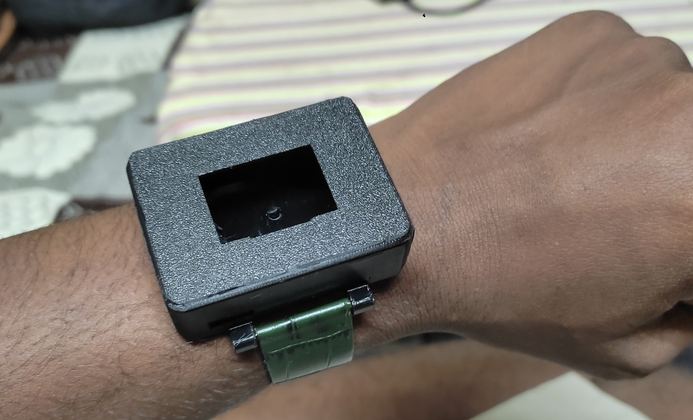
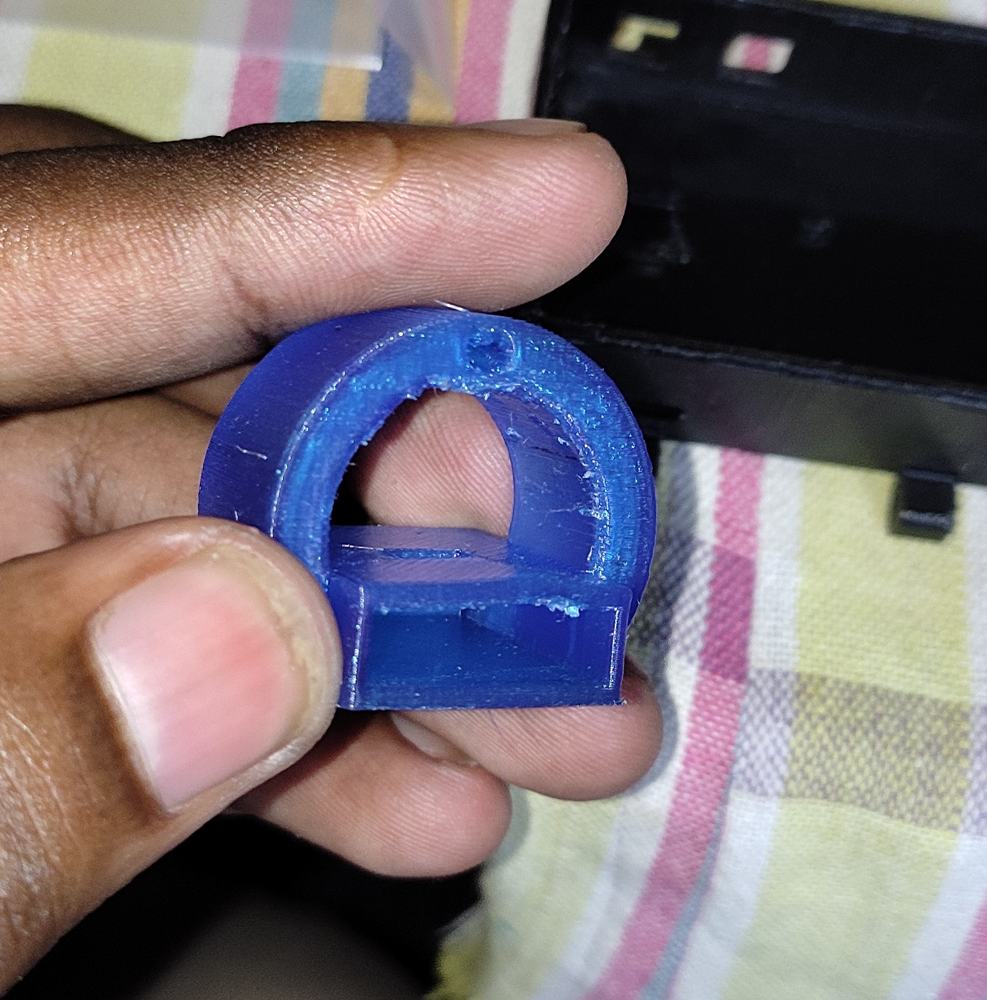
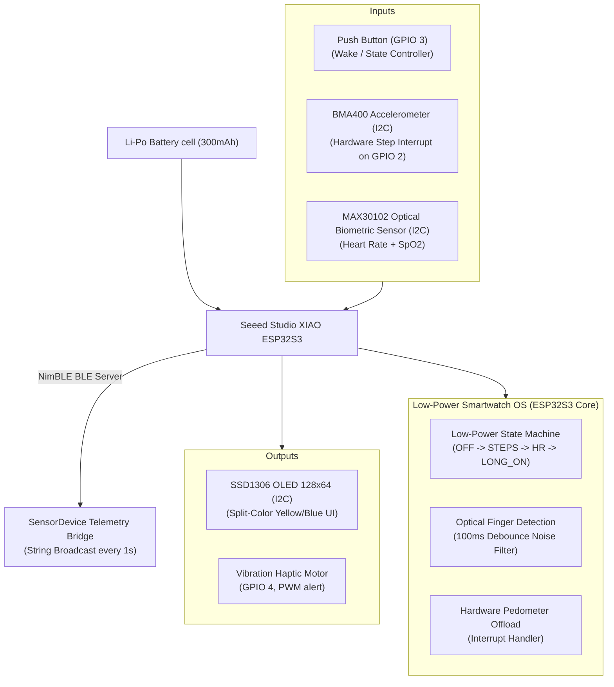
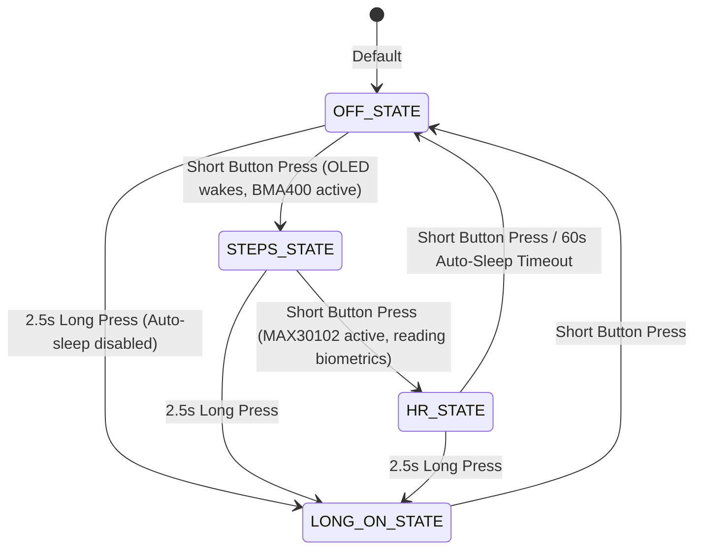

# ⌚ Wearable Health Monitoring Band / Smartwatch

> A compact, low-power wearable health band built around the Seeed Studio XIAO ESP32S3. Features heart rate & SpO₂ monitoring, hardware-offloaded step tracking, NimBLE wireless data transmission, and an active power-saving state machine.

### 📸 Physical Build & Interface Gallery

| Smartwatch on Wrist (Real Setup) | 3D Printed Heart Rate Sensor Ring |
| :---: | :---: |
|  |  |

---

## ⚡ Key Technical Metrics

| Metric | Value | Details |
|---|---|---|
| **Main Processor** | Seeed Studio XIAO ESP32S3 | Compact, dual-core Tensilica Xtensa LX7 |
| **Biometric Sensor** | MAX30102 | Heart Rate + SpO₂ via I2C |
| **Activity Tracker** | BMA400 | Ultra-low power 3-axis accelerometer |
| **Display** | SSD1306 128×64 | I2C split-color OLED (yellow/blue) |
| **BLE Protocol** | NimBLE-Arduino | Memory-optimized Bluetooth Low Energy |
| **Battery Check** | 12-bit ADC (A0) | Smoothed 47kΩ/100kΩ resistor divider |
| **Power Supply** | 300mAh Li-Po | Compact battery cell integrated in case |
| **Haptic Pin** | 5mm Button Motor | Tactile alert output on GPIO 4 |

---

## 🏗️ Hardware Architecture

### Complete Pin Configuration

| Peripheral | ESP32S3 Pin | Mode / Description |
|-----------|---|---|
| **I2C SDA** | **GPIO 5** | Data bus for MAX30102, BMA400, and SSD1306 |
| **I2C SCL** | **GPIO 6** | Clock bus for I2C peripherals |
| **Push Button** | **GPIO 3** | Input with internal pull-up (Wake/State Trigger) |
| **Haptic Motor**| **GPIO 4** | Vibration alert output |
| **BMA400 INT** | **GPIO 2** | Hardware step counter interrupt (Rising edge) |
| **Battery Sense**| **A0 (GPIO 1)**| Analog input for voltage divider check |

---

## 🧠 Core Software Logic & State Machine

### 1. Power State Machine
To maximize wearable battery life, the smartwatch operates in four distinct button-controlled hardware states:

* **`OFF_STATE`:** Display turned OFF (`SSD1306_DISPLAYOFF`), MAX30102 in sleep mode.
* **`STEPS_STATE`:** OLED wakes, showing BMA400 step count and classified activity. MAX30102 remains in standby.
* **`HR_STATE`:** Power-up of the MAX30102 for active heart rate and SpO₂ readings.
* **`LONG_ON_STATE`:** Triggered by a **2.5-second long press** (confirmed by a 250ms haptic buzz). Overrides the auto-sleep, locking the device continuously ON.
* **Auto-Sleep:** If running in standard states (`STEPS_STATE` or `HR_STATE`), the system monitors idle time and shuts down completely after **60 seconds** of inactivity (`AUTO_OFF_MS = 60000`).

### 2. Optical Finger Detection
To prevent false measurements when the watch is off the wrist:
1. The MAX30102 reads raw Infrared (IR) levels.
2. If the IR reading falls below `MIN_IR_THRESHOLD` (**50000**):
   * A debounce timer starts to confirm the finger has been removed.
   * If IR remains low for **100ms** (`NO_FINGER_CONFIRM_MS`), the state machine confirms finger removal (`noFingerConfirmed = true`).
   * The UI displays `"No Finger"`, and the BPM/SpO₂ buffers are safely cleared.

### 3. Hardware-Offloaded Step Counting
Step counting is offloaded entirely to the BMA400's internal hardware ASIC:
* The ESP32S3 configures step counter interrupts on channel 1 (`BMA400_INT_CHANNEL_1`) as active push-pull.
* When motion is detected, the BMA400 fires a rising-edge interrupt to **GPIO 2** of the ESP32S3.
* The ESP32S3 wakes briefly, updates the global `bmaStepCount` and `bmaActivityType` (`Walking`, `Running`, `Standing still`), and returns to standby, leaving the main CPU completely unburdened.

---

## 📁 Repository Structure

📂 **`Final_Watch_code/`** — Core ESP32S3 smartwatch Arduino firmware  
  * `Final_Watch_code.ino` — Core smartwatch OS, NimBLE stack, and power state machine  
📂 **`3D print final/`** — Mechanical 3D printing casing & CAD STL design files:  
  * `HR ring v2.stl` — Custom design for the optical sensor ring spacer  
  * `Watch Cap 1 v1.stl` — Casing top cap protecting the ESP32S3 and OLED assembly  
  * `Watch v1 v5.stl` — Main smartwatch chassis housing the 300mAh battery, button, and wiring  
  * `HR ring v2.png` — Casing CAD diagram render  
📂 **`images/`** — Real-world setup photos and interface details  
  * `watch_photo.jpg` — High-definition physical photo of the smartwatch active on the wrist  
  * `watch_photo_ring.jpg` — High-definition physical photo of the custom 3D printed ring  
  * `watch_face.jpg` — OLED screen showing biometrics and battery status  
  * `app_interface.jpg` — Mobile app showing active BLE health telemetry  
📄 **`Smartwatch_Final_Report.pdf`** — Complete technical project documentation report  
📄 **`README.md`** — Core project documentation  

---

## 🚀 Getting Started

### Prerequisites
- **Arduino IDE** with ESP32 board package
- **Required Libraries:**
  * `NimBLE-Arduino` (Memory-optimized BLE stack)
  * `Adafruit_SSD1306` & `Adafruit_GFX`
  * `SparkFun_BMA400_Arduino_Library`
  * `MAX30105` (Adafruit/SparkFun variant including `spo2_algorithm.h`)

### Flashing Firmware
1. Open `Final_Watch_code/Final_Watch_code.ino` in the Arduino IDE.
2. Select **XIAO ESP32S3** as the target board.
3. Click **Upload** to compile and flash.

---

## 🔬 Lessons Learned & Engineering Pivots

1. **NimBLE Stack Selection:** The standard ESP32 BLE library consumes nearly **1.1MB of flash memory**, leaving almost zero room for user interface graphics and custom sensor logics. Transitioning to **NimBLE** reduced the memory footprint by over **60%**, preserving room for high-fidelity UI rendering and reliable multitasking state machines.
2. **Voltage Divider Impedance:** The internal input impedance of the ESP32S3's analog pins can cause voltage sag under high-value resistor dividers. Tuning to a **47kΩ + 100kΩ divider** provided the ideal balance between minimal battery parasitic drain and accurate 12-bit battery state-of-charge measurements on **A0**.
3. **Optomechanical Isolation:** Switching cell casing from Nylon Carbon Fiber to **PETG** provided superior skin comfort. Added a compliance-fit **TPU inner ring** around the MAX30102 sensor lens. This soft gasket blocks ambient light leakage while keeping the skin-contact force gentle and stable.

---

## 👤 Author

**Balaji Rayudu S**  
B.Tech Electronics & Computers Engineering  
Amrita Vishwa Vidyapeetham, Bengaluru  
